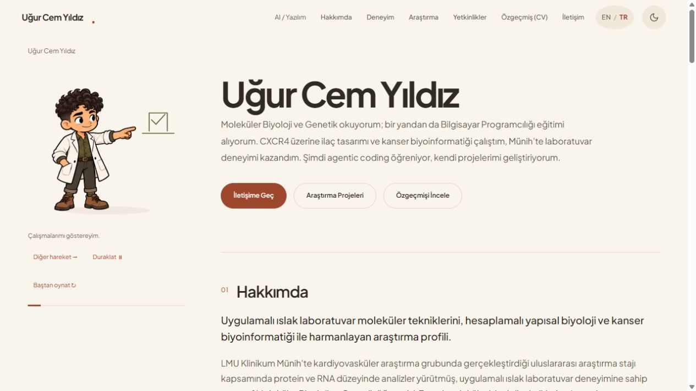

# Uğur Cem Yıldız kişisel sitesi

[English](README.md) | [Türkçe](README.tr.md) | [Canlı site](https://ugurcemyildiz.me/tr/)

Moleküler biyoloji, hesaplamalı araştırma ve yazılım çalışmalarını anlatan iki dilli kişisel site. Araştırma sayfalarında yapı temelli ilaç tasarımı ve kanser biyoinformatiği projeleri bulunuyor. Mini Uğur adlı küçük animasyonlu karakter sayfalara eşlik ediyor.



Astro ile altı statik sayfa üretiliyor. Ortak CSS ve tarayıcı betikleri tema değişimini, animasyonları ve araştırma görsellerinin görüntüleyicisini yönetiyor. Ana içeriği okumak için istemci tarafında çalışan bir arayüz çatısı gerekmiyor.

## Yerelde çalıştırma

Node.js 22.12 veya üzerini kullan:

```sh
npm ci
npm run dev
```

Astro'nun terminalde gösterdiği yerel adresi aç. Kontroller ve derleme için:

```sh
npm test
npm run build
npm run preview
```

Yayımlanacak klasör `dist/`. Yapılandırılmış üretim adresi `https://ugurcemyildiz.me`.

## Etkin kaynak dosyaları

`src/content/approved/` altındaki altı belge, gözden geçirilmiş HTML'i içerir. `src/pages/` bu belgeleri içeri alır. Ortak stiller ve etkileşimler `public/*.css` ve `public/*.js` dosyalarındadır.

Repoda kalan bazı eski yerleşim ve profil dosyaları etkin sayfalarda kullanılmıyor. Bu dosyaları değiştirmek yayımlanan sayfaları değiştirmez. İncelenmiş HTML henüz bileşen kütüphanesine dönüştürülmemiştir. Üst çalışma klasöründeki eski üretim betikleri, üretim derlemesi için gerekli değildir.

## Diller ve gizlilik

İngilizce sayfalar `/cv.pdf`, Türkçe sayfalar `/cv-tr.pdf` dosyasına bağlanır. Bu CV'ler bilerek herkese açıktır. Derleme; dil eşleşmesini, bağlantıları, kanonik adresleri ve yayımlanacak varlıkları kontrol eder. `public/` ve `dist/` içindeki özel tez belgelerini reddeder.

Bu herkese açık kaynak kopyası yeni bir Git geçmişiyle başlar. Özel dağıtım reposu ve onun geçmişindeki tez indirmeleri taşınmamıştır. Barındırma servisindeki eski dağıtımlar ayrıca incelenmelidir; güncel derleme kontrolü eski dağıtımlardan silinmiş dosyaları kapsamaz.

Güvenlik başlıkları `vercel.json` içindedir. Sayfa içi tema betikleri tam SHA-256 özetleriyle izin alır. Bu betikleri değiştirdikten sonra `npm run security:headers` çalıştırıp politikayı gözden geçir. İncelenmiş HTML ve karakter çizimi kullandığı için sayfa içi stillere izin verilir. Bu politika Vercel önizleme araç çubuğunun betiklerini engelleyebilir.

## Görseller ve doğrulama

Mini Uğur'un WebP görselleri kaynak PNG'lerin piksel içeriğini korur; PNG kaynakları da repoda bulunur. Yerelden sunulan Plus Jakarta Sans İngilizce ve Türkçe karakterleri kapsar. Lisansı `public/fonts/OFL.txt` dosyasındadır.

Bu kopyada çalıştırılan kontroller [doğrulama kaydında](docs/VALIDATION.tr.md) yer alır. Otomatik kontroller fiziksel telefon, Safari veya yardımcı teknoloji testlerinin yerini tutmaz. Lighthouse laboratuvar ölçümüdür; gerçek kullanıcıların INP ölçümü değildir.

## Geliştirme süreci ve kullanım hakları

Uğur Cem Yıldız tarafından geliştirildi. Uygulama ve doğrulama çalışmalarında yapay zekâ araçlarından yararlanıldı. Araştırma içeriği, yazarın biyoloji ve hesaplamalı araştırma çalışmalarını anlatır.

Özgün kod ve kişisel içerik [LICENSE](LICENSE) koşullarıyla incelemeye açıktır. Araştırma görselleri, yazı tipleri ve diğer üçüncü taraf materyaller kendi sahiplerinin haklarına ve belirtilmiş lisanslara tabidir. Repo bu varlıklar için genel yeniden kullanım izni vermez.
